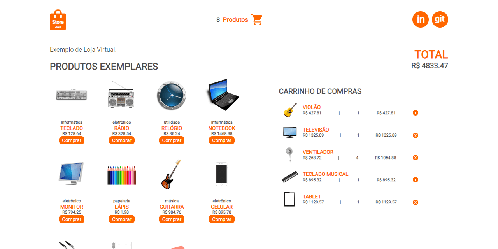
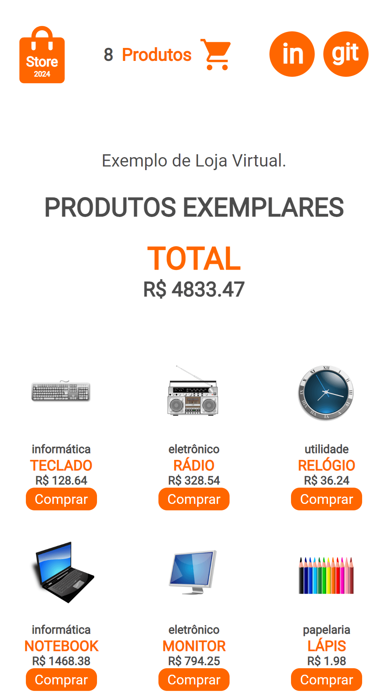

# **Store - Exemplo de Loja Virtual**

<!--  -->

## Sobre o projeto

Desenvolvi um layout responsivo utilizando Flexbox e TypeScript para garantir tipagem estática e segurança no código. Integrei uma API JSON com dados fictícios, utilizando arrays para manipulação e Context API para gerenciamento do estado global da aplicação. Implementei rotas para navegação e o design foi cuidadosamente elaborado para proporcionar uma experiência visual agradável.

O objetivo é criar um layout dinâmico em React, conectando-se a uma API fictícia com TypeScript e gerenciando o estado global usando Context API.

#### About the project

I developed a responsive layout using Flexbox and TypeScript to ensure static typing and code security. I integrated a JSON API with fictitious data, using arrays for manipulation and Context API for managing the global state of the application. I implemented navigation routes and the design was carefully crafted to provide a pleasant visual experience.

The goal is to create a dynamic layout in React by connecting to a dummy API with TypeScript and managing global state using Context API.

## Mobile Layout

## Tecnologias Utilizadas (Technologies Used)
* HTML5
* CSS3
* Flexbox
* JavaScript
* Typescript
* API JSON Fictícia
* Context API
* React Js Vite

## Instalação (Installation)

##### Instalar Dependências (Install Dependencies)
<pre><code>npm install</code></pre>

##### Executar Aplicação (Run Application)
<pre><code>npm run dev</code></pre>

## Autor (Author)

#### **Katarine Albuquerque**

 &nbsp; 
